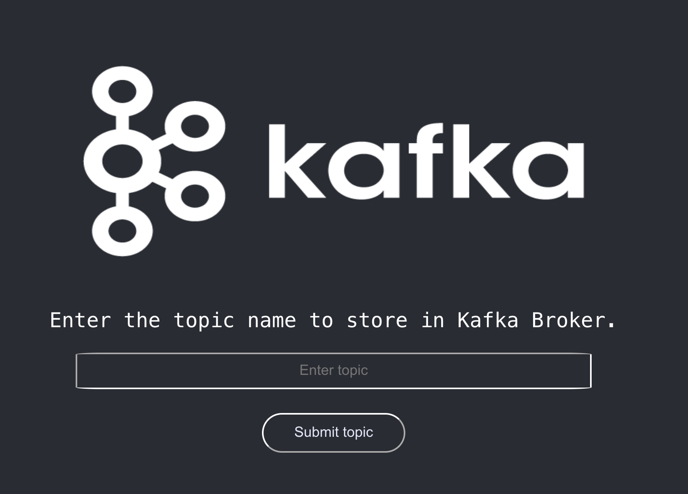
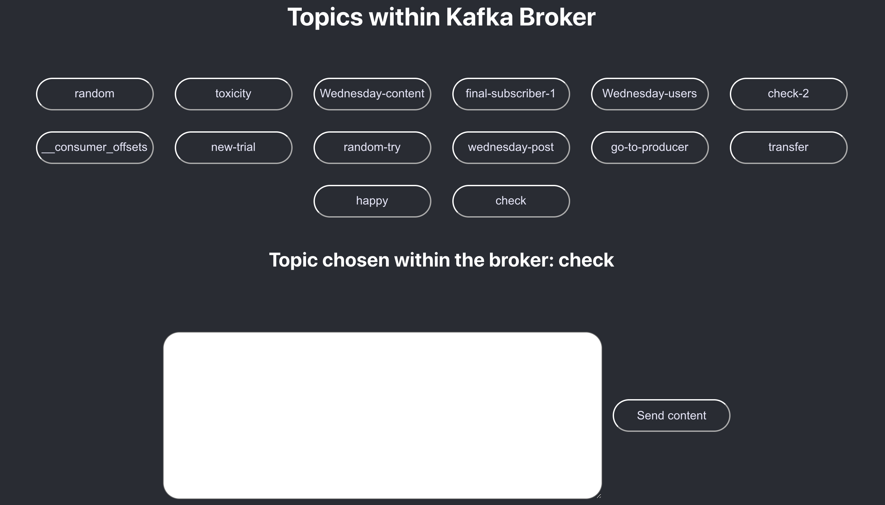
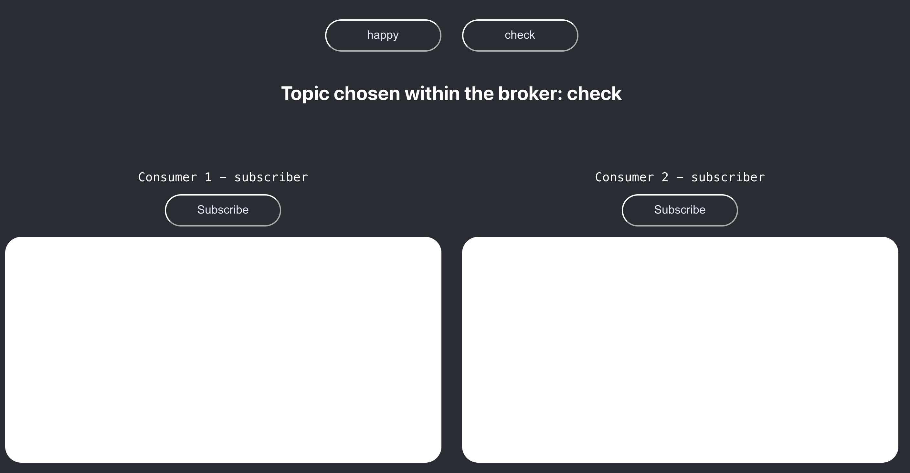

# Apache Kafka Basic Level Setup & Understanding 

In this project, the major setup to understand the flow of kafka that can be found in the `components` folder. However, it is much easier to understand the flow through a simple UI which showcase how the consumers stay subscribed to the particular topics in broker depending on this partition. 

However, the visualization in this code is only limited to 2 partitions for each topic within the broker but there certainly can be greater than 2 partition in real world applications. 

## Prerequisities 
1. Node
2. NPM
2. Docker

Additional step: 
> Go to the `scripts` folder and within it open the `kafka.sh` file. Here, replace `aemiej-mac` with the hostname of your respective machine.

## How to make this code work on CLI? 

For this, it is kind of hectic and you'll need to make changes manually to the files. If you're up for it, pretty cool otherwise you can observe its working with the web application as well.

1. First step is to spin up zookeeper and kafka with docker:

<b>If this is your very first time, do as followed -</b>
```
$ cd scripts
$ chmod +x zookeeper.sh && ./zookeeper.sh
```

Open a new terminal and do the following within scripts folder:
```
$ chmod +x kafka.sh && ./kafka.sh 
```
This will get both the containers up and running. 

<b>Not your first time, then do as followed within scripts folder -</b>
```
$ ./zookeeper.sh
$ ./kafka.sh
```

2. Next is move in to the `components` folder and do as follows: 

In one terminal, we'll create topic, in another keep the producer running and the last ones for consumer. 

Before starting, make the changes in the `components` folder: 
* Within `topic.js` => uncomment `topic(process.argv[2]);`. 
* Within `producer.js` => uncomment `producer(process.argv[2], process.argv[3]);`.
* Within `consumer.js` => uncomment `consumer(process.argv[2]);`.

After this, within a terminal you can create topic as follows: 
```
$ node topic check
```

Open another terminal and you can send content to this topic check:
```
$ node producer check checking
```

In the third terminal, you run the consumer to subscriber and get the contents from the broker:
```
$ node consumer check
```

Here, as we've 2 partitions, we can have maximum 2 consumers in a single consumer group. Thus, when the last terminal with consumer running and getting all content, you can open one more terminal with another consumer running to same topic and the content will get divided.

## How to make this code work with Web?

This is too simple, you might just cry out of happiness! 

1. In the one terminal, you will run server so just do: 
```
$ chmod +x server.sh
$ ./server.sh
```

2. Open a second terminal where we will run our client: 
```
$ cd client
$ chmod +x client.sh
$ ./client.sh
```

After this, go to your favorite browser and open `http://localhost:3000/` this will open the topics page as followed. 



In this you can add the topic, you require it will be created within the kafka broker with 2 partitions based on the rules specified. 

Once, the topic is created the producer page opens at `http://localhost:3000/producer/` with a list of topics as shown, you can click on any topic and send your content to that topic. 



Now, we want to have a consumer that subscribes to one or more topic within the consumer group and shows the content everytime the producer sends the content to broker. On another tab, open `http://localhost:3000/consumer` and click on the topic you want to subscribe to. 



Here, I have provided 2 consumers, if only 1 is subscribed then that consumer will be subscribed to both partitions of that topic however if both of them are subscribed then each consumer will be subscribed to the single partition of the topic thus exhibiting parallel processing.

To understand, the ideal case of how Apache Kafka stream processing works, you can see the [demo](https://we.tl/t-xwBGVeo6jg) and perform the operations and try it by yourself. 